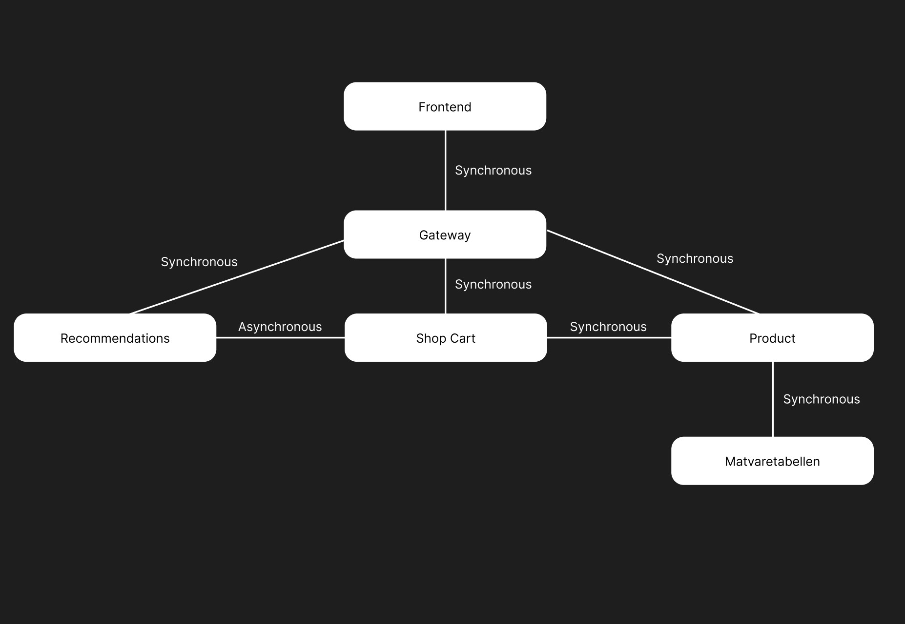

How to build and run the project:<br>
1. Open the zip file and extract the project.
2. When running locally you need to have RabbitMQ installed and running on default port 5672, and consul running on 8500.
3. Run the following command to build the project, after cding into each service:<br>
```mvn clean package```<br>
4. Run the following command to start the project:<br>
```mvn spring-boot:run```<br>
5. If you want to start multiple instances of each service, you can run the following command:<br>
```mvn spring-boot:run -Dspring-boot.run.arguments="--server.port=NEW_PORT_NUMBER"```<br>
6. And for the frontend project, run the following command:<br>
```npm install```<br>
```npm run dev```<br>
7. The project will be running on port 1234, 8081, 8082, 8083, 8500, 15672
8. You can access the project using the following URL:<br>
        Frontend:<br>
```http://localhost:1234```<br>
        Shopcart:<br>
```http://localhost:8081```<br>
        Product:<br>
```http://localhost:8082```<br>
        Recommendation:<br>
```http://localhost:8083```<br>
        Consul:<br>
```http://localhost:8500```<br>
        RabbitMQ:<br>
```http://localhost:15672```<br>

How to build and run the project with docker:<br>
1. Open the zip file and extract the project.
2. Run the following command to build the project, after cding into each service:<br>
```mvn clean package```<br>
3. Run the following command to build the docker image:<br>
```docker build -t <image-name> .```<br>
4. Run the following command to start the docker container:<br>
```docker run -p <port>:<port> <image-name>```<br>
5. Or you can use docker-compose to start the project:<br>
```docker-compose up``` to start rabbitmq, and consul<br>
```docker-compose -f docker-compose-services.yml up``` to start rabbitmq, consul and all the services<br>
6. The project will be running on port 1234, 8081, 8082, 8083, 8500, 15672

When running the project with docker, you need to change the following:<br>
1. In application.properties file in shopCart, change the following:<br>
```spring.rabbitmq.host=localhost``` -> ```spring.rabbitmq.host=rabbitmq```<br>
```product.service.url=http://localhost:8082``` ->```product.service.url=http://product:8082```<br>
2. In application.properties file in recommendation, change the following:<br>
```spring.rabbitmq.host=localhost``` -> ```spring.rabbitmq.host=rabbitmq```<br>
```shopcart.service.url=http://localhost:8081``` ->```shopcart.service.url=http://shopcart:8082```<br>
3. For some reason i couldn't get consul-kv-docker.json to actually so i have to manually change the application.properties files in the services to point to the correct rabbitmq host, and shopCart and product url.

How to use the project:<br>
1. After all services are up and running, you can access the frontend using the following URL:<br>
```http://localhost:1234```<br>
2. Here you can create a new cart, which takes you to the cart page, from here you can go to the searchbar and add products to the shopping cart, or you could set allergies and desired nutritional values, and get recommendations.
3. When you first start the project the product list will be empty, therefore you have to press the "Get products" button to get fetch the products from matvaretabellen.no, and add them to the product list.
4. When you add or remove a product from the cart, a message is sent to rabbitmq, and the recommendation service will get the message and update the recommendations.
5. You can create as many shopping carts as you like, and each shopping cart will have their own allergens and nutritional values.

Overview:<br>
For my exam, I'm developing a food shopping list program that not only tracks the items you add but also provides nutritional data for each of the items. The program will summarize the nutritional facts and suggest healthy items based on what your list lacks in key nutrients. I'm using the Mattilsynet API, which offers a list of nutritional facts for most food types (though it won't account for brand-specific differences). The ultimate goal of the program is to create a user-friendly shopping list that makes it easy for people to plan their shopping trips while also being mindful of their nutritional intake. This is ideal for not only people trying to track what they eat in a week but also for people wanting a convenient way to build healthier shopping and eating habits. This program bridges the gap between regular shopping list apps and dedicated nutritional tracking apps and offers a combined solution that helps encourage everyday healthier choices in an accessible way.  Additionally, the program includes a feature to set allergens, allowing users to avoid adding products they are allergic to.


User stories:<br>
1. As a bodybuilder, I want to be able to check and measure what I eat in a day, so that I can reach my goals.
2. As a person with allergies, I want to be able to set what allergens I have, so that I can avoid added products I am allergic to.
3. As a student, I want to be able to create a shopping cart, so that I can structure my shopping list and save money.
4. As a person who strives to eat healthy, I want to get recommendations on what products I should buy, so that I can eat healthier.
5. As a family man, I want to be able to set up grocery lists for each day of the week, so that I can plan my meals and save time.


Diagram:<br>


Problems:<br>
1. I had some problems with the consul-kv-docker.json file, and couldn't get it to work, so i had to manually change the application.properties files in the services to point to the correct rabbitmq host, and shopCart and product url.
2. I had some problems with correct java version on my system, and had to manually change the java version on my system to 21.0.1. with this command: <br>
```export JAVA_HOME=$(/usr/libexec/java_home -v 21)``` <br> 
```export PATH=$JAVA_HOME/bin:$PATH```